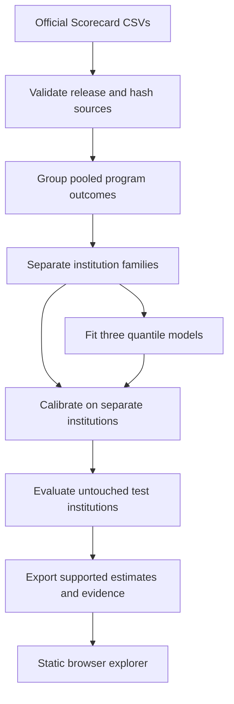

# Withheld

**College outcomes, with the gaps left in.**

[Open the live explorer](https://rishikrrontala-bot.github.io/gibc-v2/) · [Submission draft](submission/DEVPOST.md) · [Validation data](public/data/metrics.json) · [Limitations](docs/LIMITATIONS.md)

Built by **Rishik Rontala**, solo, for **Global Innovation Build Challenge V2 — Track 02: Applied (Medical Technology & Finance)**.

## The problem

In the June 10, 2026 College Scorecard release, **137,408 of 194,211 program records (70.8%)** suppress their five-year median earnings. Another 15,521 have no value for other reasons. These are counts of program records, **not students**. Multiple campus records may share a pooled outcome.

Withheld is an empirical research prototype for exploring the information gap. It keeps official observations separate from model estimates, puts uncertainty beside every estimate, and declines to estimate programs with little comparable training evidence.

**This is not financial advice, an official eligibility determination, a salary forecast, or a system for real-money decisions.** Published outcomes are historical, privacy-protected statistics. Suppressed values remain unknown.

## What works

- Search **3,568** institutions by name or initialism; browse all 194,211 program records.
- Filter by program, credential and source. Share a deep link to an individual record.
- View official earnings, or a supported model estimate with a target-80% interval. Otherwise, see a clear abstention.
- Adjust an illustrative comparison benchmark. It is **not** a federal threshold.
- Explore fixed-rate loan amortization using published debt or a clearly hypothetical amount.
- Compare up to three programs and export provenance-labelled CSV files.
- Read the held-out validation report, including the intervals' coverage shortfall and small-program performance.
- All searches and calculations run in the browser. No sign-in, API key, analytics or paid service.

## Evidence, not invented accuracy

An institution-family-grouped 60/20/20 split separates fitting, calibration and final testing. Training uses **22,975** pooled program outcomes. Calibration uses **7,664**; final testing uses **8,723** outcomes from **594** held-out institution families. There is zero OPEID6 overlap across splits.

| Method | Test mean absolute error |
|---|---:|
| Withheld quantile-boosting middle estimate | $9,029.87 |
| Field × credential training median | $10,247.57 |
| State × credential training median | $16,973.55 |
| Global training median | $19,406.17 |

The full test-set intervals cover **77.554%** of published outcomes against an 80% target. Mean width is **$26,179.17**. Coverage for test programs under 30 reported completions is **74.632%**. The supported subset (the app's ≥30-peer policy) has MAE **$7,901.28** and coverage **78.863%** on 6,827 held-out published outcomes.

**None of these results establishes coverage on genuinely suppressed outcomes.** They have no public labels and are not missing at random. We do not tune to the test result after seeing it. See [the model card](docs/MODEL-CARD.md) and [raw held-out predictions](pipeline/test-predictions.csv).

## How it works



LightGBM models estimate the 10th, 50th and 90th quantiles. Features are field, broad field, credential, state, institution control and log reported completions. No earnings, debt, repayment, institution ID or individual record is an input feature. Split-conformal nonconformity corrections expand intervals by completion-size band. The browser displays precomputed predictions from the frozen model; it does **not** claim live model inference or private-value recovery.

## Run locally

Prerequisites: **Node.js 22.12+** and npm. Python is only needed to reproduce training; the complete prepared data is checked in.

```sh
npm ci
npm run dev
```

Open the local URL printed by Vite. For a production build:

```sh
npm run build
npm run preview
```

No environment variables, server credentials or external inference services are needed. The app loads college details by state on demand.

## Verify

```sh
npm test
python3 pipeline/verify.py
npx playwright install chromium
npm run test:e2e
```

The unit/data-integrity tests cover arithmetic, uncertainty boundaries, search, safe CSV export, unique program IDs and every shipped estimate's support and interval ordering. Browser tests exercise the full judge journey, mobile overflow, deep links, exports and a failed-data retry. `pipeline/verify.py` independently recomputes test MAE, coverage and split isolation.

## Reproduce the model

Python **3.12** was used for the recorded run. A CPU is sufficient; no GPU is required.

```sh
python3 -m venv .venv
. .venv/bin/activate
pip install -r pipeline/requirements.txt
python pipeline/fetch.py
OMP_NUM_THREADS=4 python pipeline/train.py
python pipeline/verify.py
```

The downloader verifies the pinned official ZIP hashes before extraction. Training writes three LightGBM text models, fixed split keys, held-out predictions, validation metrics, provenance and the static data. Raw source downloads are excluded from Git. See [dataset provenance](docs/DATA.md). The six categories' vocabulary is built without target values; all fitting statistics and baseline medians use training outcomes only.

## Demonstration and submission

The prepared demo, screenshots, script and paste-ready Devpost text live under [`submission/`](submission/). The video must still be uploaded to **YouTube, Vimeo or Youku** and its URL added to Devpost. A GitHub-hosted MP4 alone does not meet the event's video-host requirement. See [`HANDOFF.md`](HANDOFF.md) for the actual remaining steps.

## Limitations and scope

This is cross-sectional validation, not a future cohort forecast. Historical earnings and debt may describe different cohorts, reference years and populations. Published earnings themselves contain privacy noise. Intervals predict a **program median**, not a distribution of individual salaries. Completion counts are not earnings-cohort sizes. The app abstains for 87,366 privacy-suppressed records and does not fill non-suppression missing values. Comparison pins are session-local and disappear on reload. No causal return-on-investment claim, school ranking, individualized advice or automated lending is provided.

## AI disclosure and credits

- **OpenAI Codex** assisted with implementation, the data pipeline, tests, documentation and demo production in this build, directed by Rishik Rontala.
- **Claude Code (Anthropic)** assisted with the earlier concept, research and planning branch. Historical planning documents are retained, but this README and the generated manifest describe the shipped scope.
- Data: **U.S. Department of Education College Scorecard**, official June 10, 2026 release. Data.gov metadata specifies **Creative Commons Attribution (CC BY)**. Source links and SHA-256 hashes are in [`public/data/manifest.json`](public/data/manifest.json). Outputs are transformed research results, not endorsed by ED.
- Code: TypeScript, Vite, Canvas 2D, Python, pandas, NumPy, scikit-learn, LightGBM, Vitest, Playwright, GitHub Actions and GitHub Pages.
- Fonts: Instrument Serif, Inter and JetBrains Mono, self-hosted via Fontsource under their open font licenses.
- Visual inspiration: **Unseen Studio**, studied through **Mobbin**; original implementation, no copied website assets or affiliation. Design process references: Impeccable and Emil Kowalski's animation skills.
- Demo tooling and voice attribution are recorded in [`submission/VIDEO-SCRIPT.md`](submission/VIDEO-SCRIPT.md).

Code is MIT licensed. Dataset and font licenses remain separate. No user interviews, traction, endorsements or deployment to real financial decisions are claimed.
